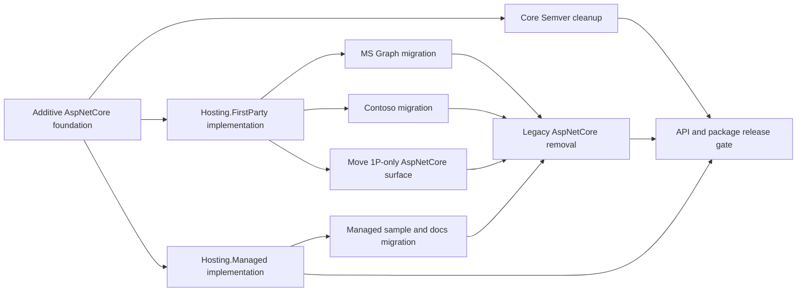

# Bicep Extensibility SDK Restructuring - Follow-up Plan

> Status: follow-up work after the additive AspNetCore foundation PR. This document intentionally
> omits work implemented by that PR and describes only the remaining migrations, removals, and
> release gates.

## Target state

- `Azure.Deployments.Extensibility.Core`, `Azure.Deployments.Extensibility.AspNetCore`, and
  `Azure.Deployments.Extensibility.Hosting.Managed` expose no version-range API and have no direct or
  transitive `Semver` dependency.
- `Azure.Deployments.Extensibility.Hosting.FirstParty` is the only package that owns version-range
  parsing, overlap validation, and multi-version selection.
- AspNetCore exports no application wrapper, concrete extension/version/resource builder, range-aware
  registry, or legacy dispatcher.
- Managed and FirstParty hosts compose with the standard `WebApplicationBuilder` and `WebApplication`.
- MS Graph, Contoso, and the in-repo sample no longer reference the legacy AspNetCore hosting path.
- No Managed package is published until its AspNetCore dependency is clean.

## Dependency order

Core cleanup and the two hosting SDK implementations can proceed in parallel. Legacy removal cannot
start until both external 1P consumers and all in-repo call sites have migrated.

## PR 1: Remove Core's stale Semver dependency

**Repository:** `Azure/bicep-extensibility`

Remove:

- The unused `using Semver;` from
  `src/Azure.Deployments.Extensibility.Core/V2/Contracts/Handlers/IHandler.cs`.
- The `Semver` package reference from
  `src/Azure.Deployments.Extensibility.Core/Azure.Deployments.Extensibility.Core.csproj`.

**Gates:**

- Build and test Core.
- Pack Core and verify that its package dependency closure contains no `Semver` reference.

## PR 2: Implement Hosting.FirstParty

**Repository:** `Mgmt-Governance-Blueprint`

Build the FirstParty host on the shared AspNetCore registration and resolver contracts:

- Add `IBicepFirstPartyExtensionBuilder` with global behavior registration and
  `AddVersion(string, Action<IBicepExtensionBuilder>)`.
- Create one `BicepExtensionRegistration` per configured range.
- Keep `SemVersionRange`, range parsing, and the range table internal to Hosting.FirstParty.
- Implement `IBicepExtensionResolver` by parsing the exact route version and selecting one registration.
- Reject duplicate or overlapping ranges during startup. Do not define precedence between overlaps.
- Add aggregate and granular standard-host integration for existing 1P applications.
- Register and map no default health endpoint.
- Provide FirstParty-owned replacements for tenant identity enrichment before those surfaces are
  removed from AspNetCore.

**Gates:**

- Test exact boundaries, prereleases, malformed versions, unmatched versions, duplicate ranges, and
  overlapping ranges.
- Test behavior ordering and unsupported-version wrapping by global behaviors.
- Test both bare routes and a host-owned `MapGroup(prefix)` integration.
- Verify that no health services or `/ping` endpoint are added by default.

## PR 3: Migrate MS Graph

**Repository:** the MS Graph extension repository

- Replace `ExtensionApplication` with the standard ASP.NET Core host.
- Move all version registrations to Hosting.FirstParty.
- Preserve global and per-version behavior ordering, default handlers, request-header access, and
  existing route behavior.
- Remove all references to `ExtensionApplication`, `ExtensionVersionBuilder`, `ResourceTypeBuilder`,
  `HandlerRegistry`, and `HandlerBehaviorRegistry`.

**Gates:**

- Build and run the Graph extension against the additive AspNetCore package and Hosting.FirstParty.
- Exercise every supported version plus malformed and unsupported versions.
- Confirm that v2 handlers can still resolve `IHttpContextAccessor`.

## PR 4: Migrate Contoso

**Repository:** `Mgmt-Governance-Blueprint`

- Replace `ExtensionApplication` with the standard ASP.NET Core host.
- Use the granular FirstParty and shared AspNetCore helpers so the application retains control over
  MISE/authentication ordering, custom exception handling, and route groups.
- Preserve the existing endpoint prefix and host-owned health behavior.
- Remove all references to the legacy AspNetCore hosting and registry types.

**Gates:**

- Run Contoso unit and integration tests.
- Verify authentication/authorization/MISE and extension middleware order.
- Exercise contract endpoints beneath the existing route prefix.
- Confirm that Hosting.FirstParty does not add another health endpoint.

## PR 5: Implement Hosting.Managed

**Repository:** `Azure/bicep-extensibility`

- Add `AddBicepExtension(Action<IBicepExtensionBuilder>)` over one immutable registration.
- Add an exact-version `IBicepExtensionResolver`; compare the incoming route version ordinally and do
  not parse it as a range.
- Read extension identity from assembly metadata emitted from the extension project's MSBuild
  properties.
- Add the Managed aggregate that installs shared middleware, bare contract routes, health services,
  and fixed `GET /ping` on the real `WebApplication`.
- Fail clearly when identity metadata, the resolver, or required application integration is missing or
  duplicated.

Keep this package unpublished until PR 8 completes.

**Gates:**

- Test exact match and mismatch without any range parsing.
- Test required bare routes and `/ping`, including duplicate aggregate calls.
- Verify that arbitrary user services, middleware, and endpoints remain available.
- Pack a scratch consumer and verify that it uses only public SDK APIs.

## PR 6: Migrate the sample and authored documentation

**Repository:** `Azure/bicep-extensibility`

The current Magic Eight Ball sample serves v1 and v2 from one `ExtensionApplication`. A Managed process
owns one exact version, so choose one of these forms before removing the legacy path:

1. Prefer one Managed sample version in this repository and move the multi-version example to the
   Hosting.FirstParty repository.
2. If both sample versions must remain here, split them into two Managed executables.

Update these authored surfaces to use the standard host and the new hosting APIs:

- `sample/MagicEightBallExtension/Program.cs`
- `sample/MagicEightBallExtension/README.md`
- `src/Azure.Deployments.Extensibility.AspNetCore/README.md`
- `docs/index.md`
- `docs/sdks/index.md`
- `docs/sdks/aspnetcore.md`
- `docs/tutorials/getting-started.md`
- `docs/tutorials/behaviors.md`
- `docs/tutorials/typed-handlers.md`
- Legacy symbol references in `spec/http.tsp`

Retain the generic Scalar explorer as shared tooling: expose its `WebApplication` mapping helper for
standard-host use and call it directly from the sample. `OpenApiExamplesBuilder` remains shared; it does
not depend on version ranges or tenant identity.

Do not hand-edit generated DocFX output under `docs/_site` or generated API metadata.

**Gates:**

- Build and run every retained sample executable.
- Exercise supported, unsupported, and malformed versions, behavior ordering, and LRO dispatch.
- Build TypeSpec and DocFX output using the repository workflows.
- Search authored docs and sample code for the legacy symbols listed in PR 8.

## PR 7: Move FirstParty-only AspNetCore surfaces

**Repositories:** `Mgmt-Governance-Blueprint`, then `Azure/bicep-extensibility`

Remove the shared package's ownership of 1P tenant identity only after Hosting.FirstParty has equivalent
functionality and both 1P consumers use it:

- Remove `HomeTenantId` and `ClientTenantId` from
  `src/Azure.Deployments.Extensibility.AspNetCore/Constants/RequestHeaderNames.cs`.
- Remove `GetHomeTenantId()` and `GetClientTenantId()` from
  `src/Azure.Deployments.Extensibility.AspNetCore/HttpContextExtensions.cs`.
- Remove tenant fields from the logging scope in
  `src/Azure.Deployments.Extensibility.AspNetCore/Middlewares/RequestCorrelationMiddleware.cs`.
- Remove tenant headers from `spec/http.tsp` and regenerate the shared OpenAPI contract.
- Remove tenant header examples from
  `src/Azure.Deployments.Extensibility.AspNetCore/Extensions/ScalarExtensions.cs` while retaining its
  generic request, correlation, language, trace, and exact-version examples.

Keep the shared client request ID, correlation request ID, response request ID, and correlation
middleware. Those headers are part of the shared HTTP contract. Keep the generic Scalar explorer and
`OpenApiExamplesBuilder` in AspNetCore.

**Gates:**

- Verify Graph and Contoso tenant logging from Hosting.FirstParty.
- Verify shared correlation behavior without tenant headers.
- Confirm that the shared TypeSpec, OpenAPI document, middleware, accessors, and Scalar examples no
  longer reference tenant identity.

## PR 8: Remove the legacy range-aware AspNetCore graph

**Repository:** `Azure/bicep-extensibility`

Treat this as one coordinated breaking PR. Delete in reverse dependency order so intermediate commits
remain understandable:

1. Remove
  `src/Azure.Deployments.Extensibility.AspNetCore.Tests.Unit/ExtensionApplicationTests.cs` after the
  last legacy consumer is gone.
2. Delete `src/Azure.Deployments.Extensibility.AspNetCore/ExtensionApplication.cs`.
3. Delete the legacy host helpers:
  `src/Azure.Deployments.Extensibility.AspNetCore/Extensions/WebApplicationExtensions.cs` and
  `src/Azure.Deployments.Extensibility.AspNetCore/Extensions/WebApplicationBuilderExtensions.cs`.
4. Delete the concrete range-aware builders:
  `src/Azure.Deployments.Extensibility.AspNetCore/Builders/ExtensionVersionBuilder.cs` and
  `src/Azure.Deployments.Extensibility.AspNetCore/Builders/ResourceTypeBuilder.cs`.
5. Delete the wrapper-only
  `src/Azure.Deployments.Extensibility.AspNetCore/Builders/ScalarApiExplorerBuilder.cs`; retain the
  standard-host Scalar mapping helper and `OpenApiExamplesBuilder`.
6. Delete the legacy HTTP adapter:
  `src/Azure.Deployments.Extensibility.AspNetCore/Handlers/HandlerDispatcher.cs`.
7. Delete the range-aware registries:
  `src/Azure.Deployments.Extensibility.AspNetCore/Handlers/HandlerRegistry.cs` and
  `src/Azure.Deployments.Extensibility.AspNetCore/Behaviors/HandlerBehaviorRegistry.cs`.
8. Delete legacy-only fallback and pipeline types:
  `src/Azure.Deployments.Extensibility.AspNetCore/Handlers/UnknownExtensionVersionHandler.cs`,
  `src/Azure.Deployments.Extensibility.AspNetCore/Handlers/UnknownResourceTypeHandler.cs`, and
  `src/Azure.Deployments.Extensibility.AspNetCore/Behaviors/ErrorResponseExceptionHandlingBehavior.cs`.
9. Remove the `Semver` package reference from
  `src/Azure.Deployments.Extensibility.AspNetCore/Azure.Deployments.Extensibility.AspNetCore.csproj`.

Do not remove the new `BicepExtensionRegistration`, `IBicepExtensionResolver`, internal
`HandlerInvoker`, new HTTP dispatcher, public shared DI/middleware helpers, or
`IEndpointRouteBuilder` endpoint helpers.

**Required preconditions:**

- MS Graph and Contoso are deployed on Hosting.FirstParty.
- The Magic Eight Ball sample and all authored docs use a new hosting SDK.
- Hosting.FirstParty owns all required range and 1P identity behavior.
- Hosting.Managed passes its package-consumer tests but has not been published.

**Gates:**

- Build the full solution and run every unit-test project.
- Pack Core and AspNetCore.
- Build MS Graph and Contoso against the packed clean AspNetCore package.
- Build a public-only FirstParty consumer and a public-only Managed consumer.
- Verify that Core and AspNetCore source, exported APIs, assembly references, and recursive NuGet
  dependencies contain none of:
  `Semver`, `SemVersionRange`, `ExtensionApplication`, `AddExtensionVersion`,
  `ExtensionVersionBuilder`, `ResourceTypeBuilder`, `HandlerRegistry`, or
  `HandlerBehaviorRegistry`.

## PR 9: API gate and release

**Repositories:** `Azure/bicep-extensibility` and `Mgmt-Governance-Blueprint`

- Add or update the public API baseline/ApiCompat checks for the clean packages.
- Publish clean Core and AspNetCore packages first.
- Update Hosting.FirstParty to the released clean packages and rerun Graph and Contoso validation.
- Publish Hosting.Managed only after that dependency update is complete.
- Verify the released Managed dependency graph contains no transitional AspNetCore package or Semver
  assembly.

## Later work

- Add the separate TypeGeneration SDK and extension-bundle workflow.
- Complete broader public documentation after the clean hosting packages are available.
- Remove any temporary compatibility notes or package pins introduced during the coordinated migration.