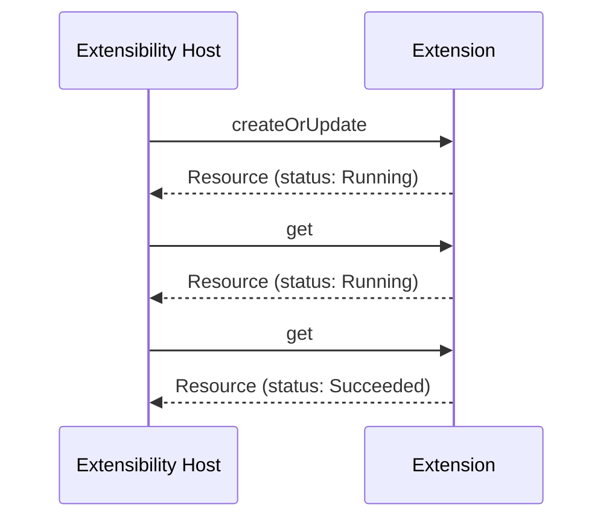
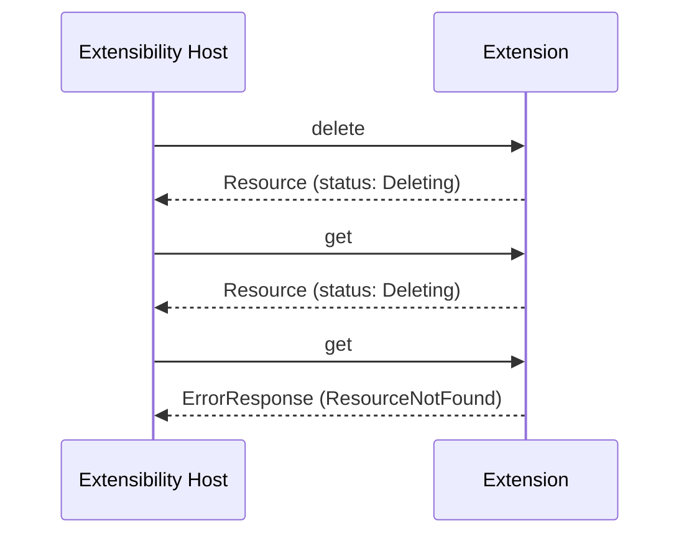
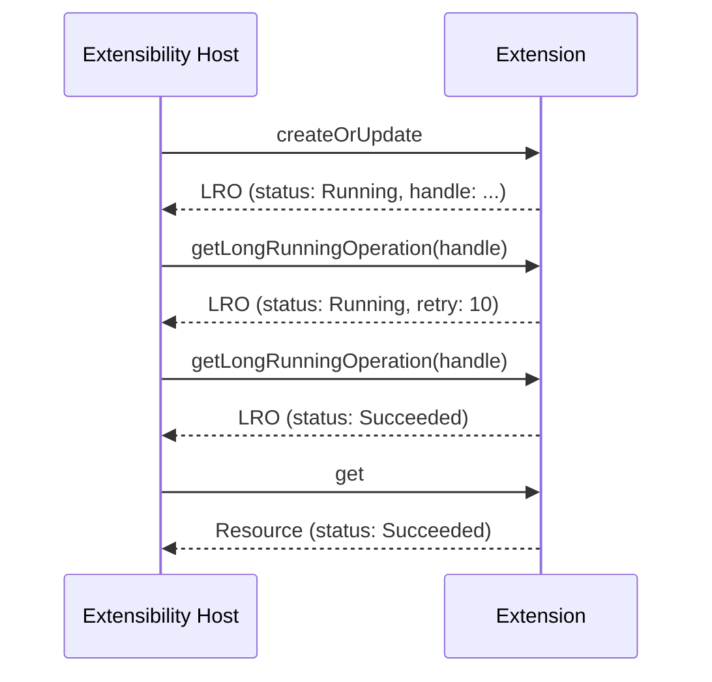
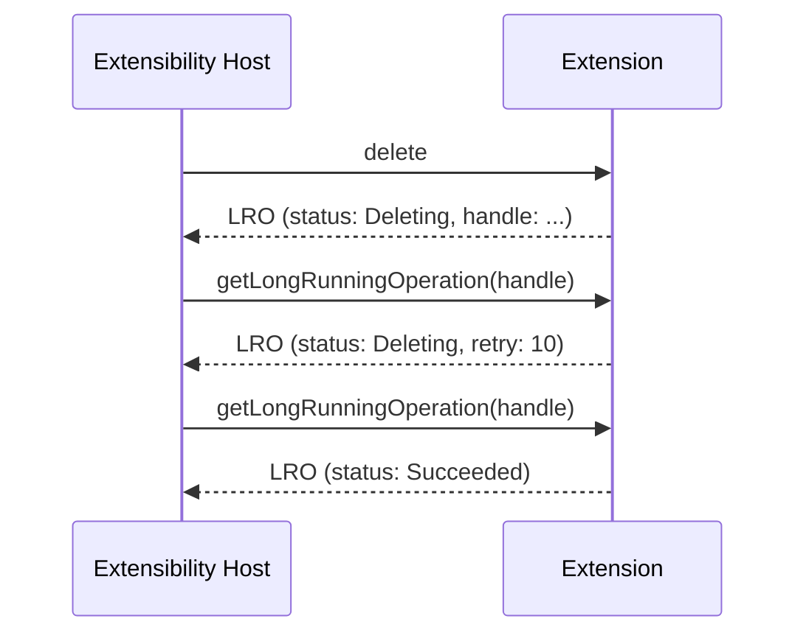

# Asynchronous Operations

This document provides detailed guidance and examples for implementing asynchronous (long-running) operations. For the core contract, see [contract.md](contract.md).

## Overview

Some resource operations cannot complete synchronously, either because they would exceed the 60-second request timeout, or because the underlying API the extension calls is itself asynchronous. The Extensibility Host supports two patterns for handling these:

| Pattern | Name | Polling Mechanism | Supported Operations |
|---------|------|-------------------|---------------------|
| **RELO** | Resource-based long-running operation | Poll the resource via get | CreateOrUpdate, delete |
| **LRO** | Stepwise long-running operation | Poll a separate operation endpoint | CreateOrUpdate, delete |

**RELO is preferred** and should be used whenever possible. Use LRO only when RELO is not feasible for the underlying API.

For additional context, see the [Azure REST API Guidelines](https://github.com/microsoft/api-guidelines/blob/vNext/azure/Guidelines.md#long-running-operations--jobs) and [Microsoft Graph REST API Guidelines](https://github.com/microsoft/api-guidelines/blob/vNext/graph/patterns/long-running-operations.md).

## Key Models

### Resource (used by RELO)

In RELO, the extension returns a `Resource` with the `status` field set to a non-terminal value:

```typespec
model Resource {
  type: string;
  apiVersion?: string;
  identifiers: Record<unknown>;
  properties: Record<unknown>;
  config?: Record<unknown>;
  configId?: string;
  status?: OperationStatus;    // e.g., "Running", "Succeeded", "Failed"
  error?: Error;               // set only when status is "Failed"
}
```

### LongRunningOperation (used by LRO)

In LRO, the extension returns a `LongRunningOperation` with an `operationHandle` for polling:

```typespec
model LongRunningOperation {
  status: OperationStatus;
  retryAfterSeconds?: int32;
  operationHandle?: Record<unknown>;
  error?: Error;
}
```

### Terminal vs. Non-Terminal Status

| Category | Values | Meaning |
|----------|--------|---------|
| Terminal | `"Succeeded"`, `"Failed"`, `"Canceled"` | Operation is complete. |
| Non-terminal | Any other string (e.g., `"Running"`, `"Provisioning"`, `"Deleting"`) | Operation is in progress. |

The `status` field is an open union. Extensions may define custom non-terminal values that are meaningful for their domain.

---

## RELO (Resource-Based Long-Running Operations)

### How It Works

1. The Extensibility Host sends a createOrUpdate or delete request.
2. The extension accepts the request and returns the `Resource` with a non-terminal `status`.
3. The Extensibility Host polls the resource by sending repeated get requests.
4. While the operation is in progress, the get response includes a non-terminal `status`.
5. When the operation completes:
   - **Create or update:** The get response includes the `Resource` with `status: "Succeeded"`.
   - **Delete:** The get response returns a not-found error, which the Extensibility Host interprets as a successful deletion.

#### Create or Update



#### Delete



### Key Rules

- The `status` property must persist across all subsequent get requests until another operation transitions the resource to a non-terminal state.
- If an update fails, the extension should revert modified properties to their previous values when that best reflects the final resource state.
- If a delete fails, the resource must remain accessible via get with `status` set to `"Failed"`. The `error` property should be populated if possible.

### Example: RELO Create or Update

**Step 1: createOrUpdate request**

```json
{
  "type": "Contoso.HR/employees",
  "apiVersion": "2024-04-01",
  "properties": {
    "firstName": "John",
    "lastName": "Smith",
    "department": "Engineering",
    "role": "Engineer"
  },
  "config": {
    "endpoint": "https://hr-api.contoso.com"
  }
}
```

**Step 2: Extension accepts and returns resource with non-terminal status**

```json
{
  "type": "Contoso.HR/employees",
  "apiVersion": "2024-04-01",
  "identifiers": {
    "employeeId": "emp-00042"
  },
  "properties": {
    "firstName": "John",
    "lastName": "Smith",
    "department": "Engineering",
    "role": "Engineer",
    "onboardingState": "Onboarding"
  },
  "config": {
    "endpoint": "https://hr-api.contoso.com"
  },
  "configId": "sha256:a1b2c3d4",
  "status": "Running"
}
```

**Step 3: Extensibility Host polls via get (operation still in progress)**

Get request:

```json
{
  "type": "Contoso.HR/employees",
  "apiVersion": "2024-04-01",
  "identifiers": {
    "employeeId": "emp-00042"
  },
  "config": {
    "endpoint": "https://hr-api.contoso.com"
  },
  "configId": "sha256:a1b2c3d4"
}
```

Get response:

```json
{
  "type": "Contoso.HR/employees",
  "apiVersion": "2024-04-01",
  "identifiers": {
    "employeeId": "emp-00042"
  },
  "properties": {
    "firstName": "John",
    "lastName": "Smith",
    "department": "Engineering",
    "role": "Engineer",
    "onboardingState": "Onboarding"
  },
  "config": {
    "endpoint": "https://hr-api.contoso.com"
  },
  "configId": "sha256:a1b2c3d4",
  "status": "Running"
}
```

**Step 4: Extensibility Host polls via get (operation succeeded)**

```json
{
  "type": "Contoso.HR/employees",
  "apiVersion": "2024-04-01",
  "identifiers": {
    "employeeId": "emp-00042"
  },
  "properties": {
    "firstName": "John",
    "lastName": "Smith",
    "department": "Engineering",
    "role": "Engineer",
    "onboardingState": "Succeeded",
    "email": "john.smith@contoso.com",
    "badgeNumber": "B-1234"
  },
  "config": {
    "endpoint": "https://hr-api.contoso.com"
  },
  "configId": "sha256:a1b2c3d4",
  "status": "Succeeded"
}
```

### Example: RELO Delete

**Step 1: delete request**

```json
{
  "type": "Contoso.HR/employees",
  "apiVersion": "2024-04-01",
  "identifiers": {
    "employeeId": "emp-00042"
  },
  "config": {
    "endpoint": "https://hr-api.contoso.com"
  },
  "configId": "sha256:a1b2c3d4"
}
```

**Step 2: Extension accepts and returns resource with non-terminal status**

```json
{
  "type": "Contoso.HR/employees",
  "apiVersion": "2024-04-01",
  "identifiers": {
    "employeeId": "emp-00042"
  },
  "properties": {
    "firstName": "John",
    "lastName": "Smith",
    "department": "Engineering",
    "role": "Engineer",
    "onboardingState": "Offboarding"
  },
  "config": {
    "endpoint": "https://hr-api.contoso.com"
  },
  "configId": "sha256:a1b2c3d4",
  "status": "Deleting"
}
```

**Step 3: Extensibility Host polls via get (deletion still in progress)**

```json
{
  "type": "Contoso.HR/employees",
  "apiVersion": "2024-04-01",
  "identifiers": {
    "employeeId": "emp-00042"
  },
  "properties": {
    "firstName": "John",
    "lastName": "Smith",
    "department": "Engineering",
    "role": "Engineer",
    "onboardingState": "Offboarding"
  },
  "config": {
    "endpoint": "https://hr-api.contoso.com"
  },
  "configId": "sha256:a1b2c3d4",
  "status": "Deleting"
}
```

**Step 4: Extensibility Host polls via get, resource not found (deletion succeeded)**

```json
{
  "error": {
    "code": "ResourceNotFound",
    "message": "The resource 'emp-00042' of type 'Contoso.HR/employees' was not found."
  }
}
```

The Extensibility Host interprets a not-found error during RELO delete polling as a successful deletion.

### Example: RELO Failure

If the operation fails, the extension returns the resource with `status` set to `"Failed"` and the `error` property populated:

```json
{
  "type": "Contoso.HR/employees",
  "apiVersion": "2024-04-01",
  "identifiers": {
    "employeeId": "emp-00042"
  },
  "properties": {
    "firstName": "John",
    "lastName": "Smith",
    "department": "Engineering",
    "role": "Engineer",
    "onboardingState": "Failed"
  },
  "config": {
    "endpoint": "https://hr-api.contoso.com"
  },
  "configId": "sha256:a1b2c3d4",
  "status": "Failed",
  "error": {
    "code": "OnboardingFailed",
    "message": "The onboarding workflow for employee 'emp-00042' failed due to an identity provider error."
  }
}
```

This failed state must persist across subsequent get requests until the user initiates another operation.

---

## LRO (Stepwise Long-Running Operations)

### How It Works

1. The Extensibility Host sends a createOrUpdate or delete request.
2. The extension accepts the request and returns a `LongRunningOperation` with a non-terminal `status` and an `operationHandle`.
3. The Extensibility Host polls the extension using the operation handle via the Get Long-Running Operation endpoint.
4. While in progress, the extension returns a `LongRunningOperation` with a non-terminal `status` and optionally a `retryAfterSeconds` value.
5. When complete, the extension returns a `LongRunningOperation` with a terminal `status` (`"Succeeded"` or `"Failed"` / `"Canceled"` with an `error`).

The flow differs slightly between create/update and delete: after a successful create or update, the Extensibility Host issues a final get to retrieve the resource state. Delete does not require a final get.

#### Create or Update



#### Delete



### Key Rules

- The initial response must include an `operationHandle`, an opaque object the Extensibility Host uses for polling.
- `retryAfterSeconds` is optional. If omitted, the Extensibility Host defaults to a 60-second polling interval.
- An error response from the Get Long-Running Operation endpoint indicates a *polling failure* (e.g., a network error), **not** a failure of the underlying operation. Operation failures are signaled through `status: "Failed"` with an `error` property.
- When `status` is `"Failed"` or `"Canceled"`, the `error` property must be present.

### Example: LRO Create or Update

**Step 1: createOrUpdate request**

```json
{
  "type": "Contoso.HR/employees",
  "apiVersion": "2024-04-01",
  "properties": {
    "firstName": "Jane",
    "lastName": "Doe",
    "department": "Marketing",
    "role": "Manager"
  },
  "config": {
    "endpoint": "https://hr-api.contoso.com"
  }
}
```

**Step 2: Extension accepts and returns LRO with operation handle**

```json
{
  "status": "Running",
  "retryAfterSeconds": 15,
  "operationHandle": {
    "operationId": "op-550e8400-e29b-41d4-a716-446655440000",
    "resourceType": "Contoso.HR/employees",
    "employeeId": "emp-00043"
  }
}
```

**Step 3: Extensibility Host polls (operation in progress)**

The Extensibility Host sends the `operationHandle` to the Get Long-Running Operation endpoint:

```json
{
  "operationId": "op-550e8400-e29b-41d4-a716-446655440000",
  "resourceType": "Contoso.HR/employees",
  "employeeId": "emp-00043"
}
```

Response:

```json
{
  "status": "Provisioning",
  "retryAfterSeconds": 30,
  "operationHandle": {
    "operationId": "op-550e8400-e29b-41d4-a716-446655440000",
    "resourceType": "Contoso.HR/employees",
    "employeeId": "emp-00043"
  }
}
```

**Step 4: Extensibility Host polls (operation succeeded)**

```json
{
  "status": "Succeeded"
}
```

**Step 5: Extensibility Host issues a final get to retrieve the resource state**

Get request:

```json
{
  "type": "Contoso.HR/employees",
  "apiVersion": "2024-04-01",
  "identifiers": {
    "employeeId": "emp-00043"
  },
  "config": {
    "endpoint": "https://hr-api.contoso.com"
  },
  "configId": "sha256:a1b2c3d4"
}
```

Get response:

```json
{
  "type": "Contoso.HR/employees",
  "apiVersion": "2024-04-01",
  "identifiers": {
    "employeeId": "emp-00043"
  },
  "properties": {
    "firstName": "Jane",
    "lastName": "Doe",
    "department": "Marketing",
    "role": "Manager",
    "onboardingState": "Succeeded",
    "email": "jane.doe@contoso.com",
    "badgeNumber": "B-5678"
  },
  "config": {
    "endpoint": "https://hr-api.contoso.com"
  },
  "configId": "sha256:a1b2c3d4",
  "status": "Succeeded"
}
```

### Example: LRO Delete

**Step 1: delete request**

```json
{
  "type": "Contoso.HR/employees",
  "apiVersion": "2024-04-01",
  "identifiers": {
    "employeeId": "emp-00043"
  },
  "config": {
    "endpoint": "https://hr-api.contoso.com"
  },
  "configId": "sha256:a1b2c3d4"
}
```

**Step 2: Extension accepts and returns LRO with operation handle**

```json
{
  "status": "Deleting",
  "retryAfterSeconds": 10,
  "operationHandle": {
    "operationId": "op-660e8500-f39c-52e5-b827-557766551111",
    "resourceType": "Contoso.HR/employees",
    "employeeId": "emp-00043"
  }
}
```

**Step 3: Extensibility Host polls (deletion in progress)**

```json
{
  "status": "Deleting",
  "retryAfterSeconds": 10,
  "operationHandle": {
    "operationId": "op-660e8500-f39c-52e5-b827-557766551111",
    "resourceType": "Contoso.HR/employees",
    "employeeId": "emp-00043"
  }
}
```

**Step 4: Extensibility Host polls (deletion succeeded)**

```json
{
  "status": "Succeeded"
}
```

### Example: LRO Failure

If the operation fails, the polling response includes `status: "Failed"` and an `error` object:

```json
{
  "status": "Failed",
  "error": {
    "code": "OffboardingBlocked",
    "message": "The employee 'emp-00043' cannot be offboarded because they have pending access reviews.",
    "details": [
      {
        "code": "PendingAccessReview",
        "message": "Access review 'quarterly-review' must be completed before offboarding.",
        "target": "/identifiers/employeeId"
      }
    ]
  }
}
```

### Example: LRO Cancellation

If the operation is canceled (e.g., the deployment is canceled by the user), the polling response includes `status: "Canceled"`:

```json
{
  "status": "Canceled",
  "error": {
    "code": "OperationCanceled",
    "message": "The operation was canceled by the user."
  }
}
```

---

## HTTP Binding

### RELO

| Scenario | Status Code |
|----------|-------------|
| CreateOrUpdate / delete accepted (operation in progress) | `200 OK` |
| Get polling — operation in progress or succeeded | `200 OK` |
| Get polling — delete succeeded (resource not found) | `404 Not Found` |

### LRO

| Scenario | Status Code |
|----------|-------------|
| CreateOrUpdate / delete accepted (operation in progress) | `202 Accepted` |
| Get Long-Running Operation — in progress or terminal | `200 OK` |
| Get Long-Running Operation — polling failure (not an operation failure) | `4xx / 5xx` |
| Final get after successful createOrUpdate | `200 OK` |

---

## Choosing Between RELO and LRO

| Consideration | RELO | LRO |
|---------------|------|-----|
| Simplicity | Simpler: no separate operation endpoint needed. | Requires a separate Get Long-Running Operation endpoint. |
| Polling mechanism | Uses the existing get operation. | Uses a dedicated operation handle. |
| Resource visibility during operation | Resource is visible with in-progress status. | Resource state is not directly observable until complete. |
| Status persistence | `status` persists on the resource across get requests. | Status is tracked separately from the resource. |
| Target API compatibility | Requires the target API to support reading the resource while an operation is in progress. | Works with any target API, including those that only expose an operation status endpoint. |
| Preferred for | Most create, update, and delete operations. | Operations where the resource cannot be read during processing, or where the target API only provides an operation-based polling mechanism. |

When in doubt, use RELO.
